# System Architecture Diagram - Japanese Sake Guide App

## Table of Contents
1. [High-Level Architecture](#high-level-architecture)
2. [Component Architecture](#component-architecture)
3. [Data Flow Diagrams](#data-flow-diagrams)
4. [Technology Stack](#technology-stack)
5. [Module Relationships](#module-relationships)

---

## High-Level Architecture

The Japanese Sake Guide App is built on a three-tier architecture combining a Streamlit frontend, LangGraph agent middleware, and external API integrations.

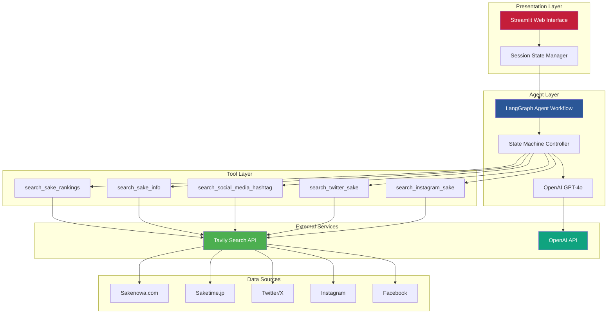

---

## Component Architecture

### 1. Application Entry Point (`app.py`)

**Responsibilities:**
- Page configuration and UI rendering
- API key validation
- Session state initialization and management
- Chat interface rendering
- User input processing
- Language preference management

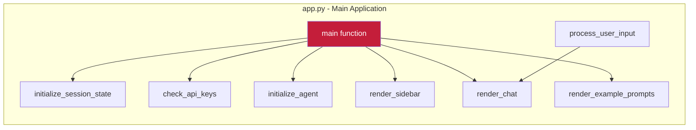

**Session State Variables:**
- `agent` - Compiled LangGraph StateGraph (singleton)
- `messages` - Display message history (list of dicts)
- `chat_history` - Agent message history (list of BaseMessage objects)
- `language` - Current UI language ("en" or "ja")

### 2. Agent Workflow (`agents/sake_agent.py`)

**Responsibilities:**
- LangGraph state machine orchestration
- Language detection from user input
- Agent execution and response extraction
- System prompt management

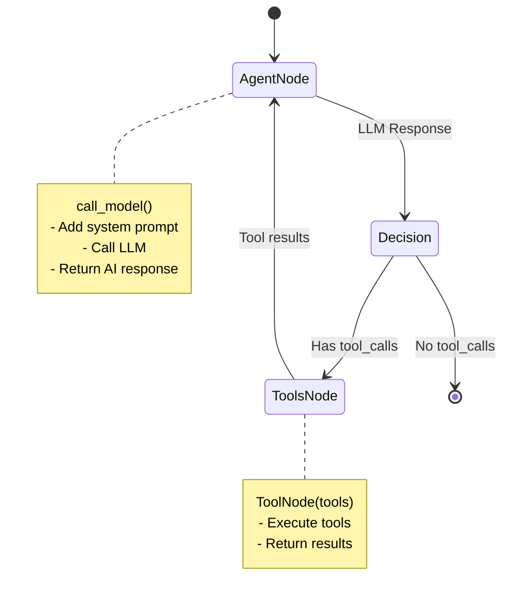

**Key Components:**
- `AgentState` - TypedDict with messages and language
- `SAKE_GUIDE_SYSTEM_PROMPT` - Expert sommelier system prompt
- `create_sake_agent()` - Builds and compiles StateGraph
- `run_sake_agent()` - Invokes agent and returns response

### 3. Agent Tools (`agents/tools.py`)

**Responsibilities:**
- Tavily API integration
- Search query enhancement
- Result formatting and truncation
- Language-aware query building

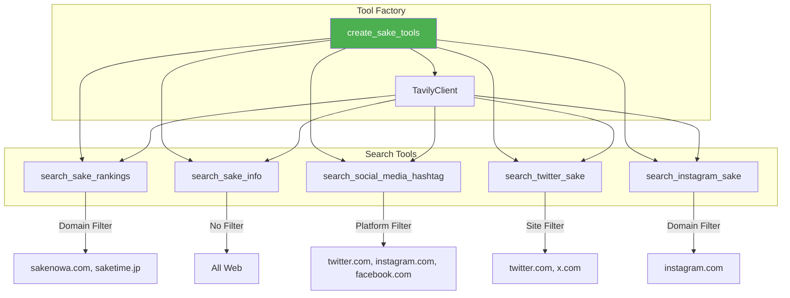

**Tool Specifications:**

| Tool | Max Results | Search Depth | Content Limit | Domain Filter |
|------|-------------|--------------|---------------|---------------|
| search_sake_rankings | 8 | advanced | 500 chars | sakenowa.com, saketime.jp |
| search_sake_info | 6 | advanced | 600 chars | None |
| search_social_media_hashtag | 10 | advanced | 300 chars | Platform-based |
| search_twitter_sake | 10 | advanced | 300 chars | twitter.com, x.com |
| search_instagram_sake | 10 | advanced | 300 chars | instagram.com |

### 4. Configuration (`config/settings.py`)

**Responsibilities:**
- Centralized settings management
- API key loading from Streamlit secrets
- Default configuration values

```python
@dataclass
class Settings:
    openai_api_key: str
    tavily_api_key: str
    instagram_access_token: Optional[str] = None
    sake_ranking_urls: tuple = (...)
    openai_model: str = "gpt-4o"
    temperature: float = 0.7
    max_search_results: int = 5
```

### 5. Utilities (`utils/helpers.py`)

**Responsibilities:**
- Language detection utilities
- Response formatting
- Example prompt constants

**Key Functions:**
- `detect_language(text)` - Analyzes text for Japanese characters
- `format_sake_response(response, language)` - Post-processes agent output

**Constants:**
- `EXAMPLE_PROMPTS` - 4 example prompts per language
- `SIDEBAR_EXAMPLE_PROMPTS` - Tool-categorized examples for sidebar

---

## Data Flow Diagrams

### 1. Application Startup Flow

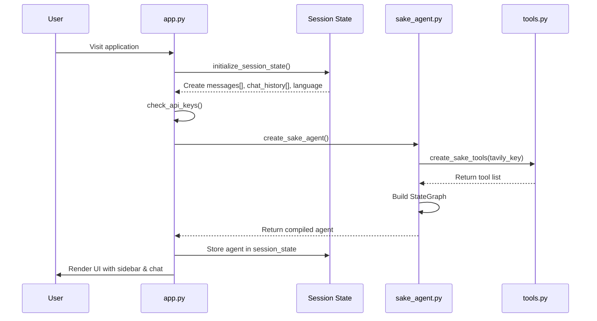

### 2. User Message Processing Flow

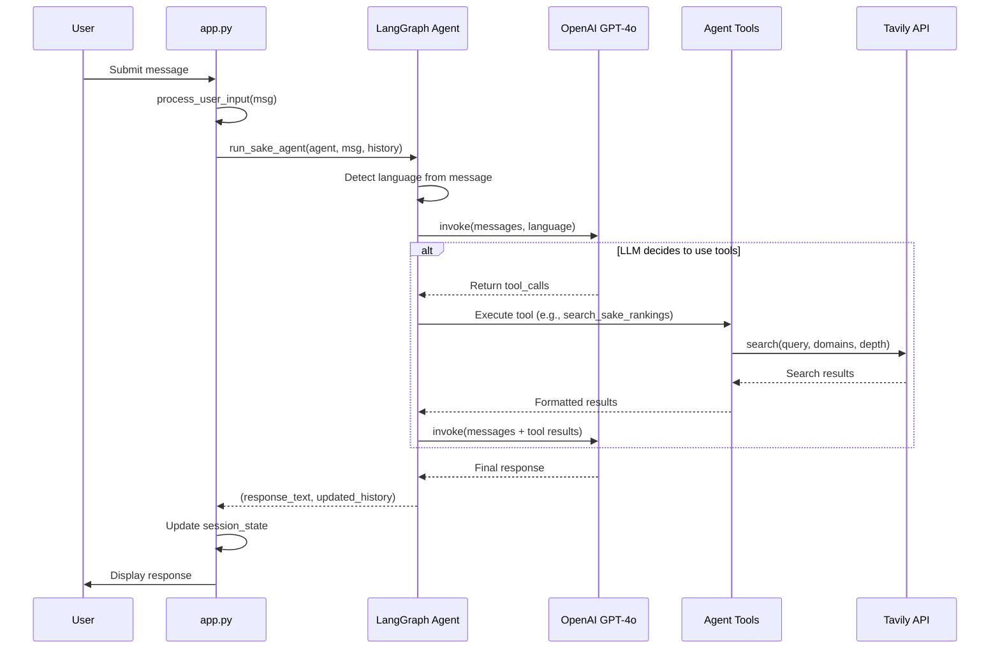

### 3. Tool Execution Flow (Detailed)


### 4. Session State Management Flow

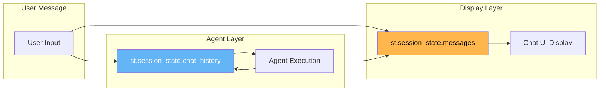

**Message Object Types:**
- **Display Messages** (`st.session_state.messages`): Dicts with `{role, content}` for UI rendering
- **Agent Messages** (`st.session_state.chat_history`): LangChain message objects (HumanMessage, AIMessage, ToolMessage)

---

## Technology Stack

### Core Dependencies

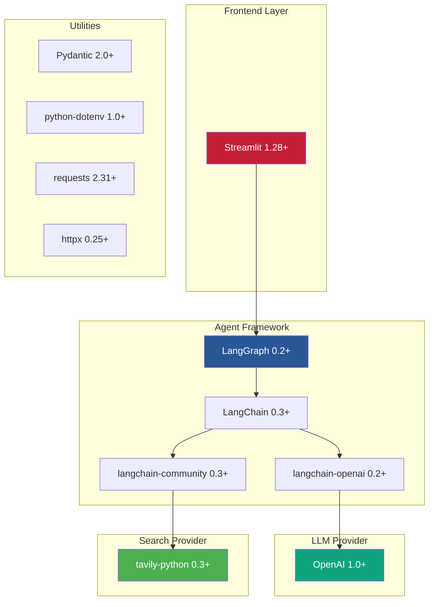

### External Services

| Service | Purpose | Authentication | Configuration |
|---------|---------|----------------|---------------|
| **OpenAI API** | LLM for agent reasoning | API Key | `OPENAI_API_KEY` in secrets |
| **Tavily API** | Web and social media search | API Key | `TAVILY_API_KEY` in secrets |
| **Streamlit Cloud** | Application hosting | OAuth | Automatic deployment |

---

## Module Relationships

### Dependency Graph

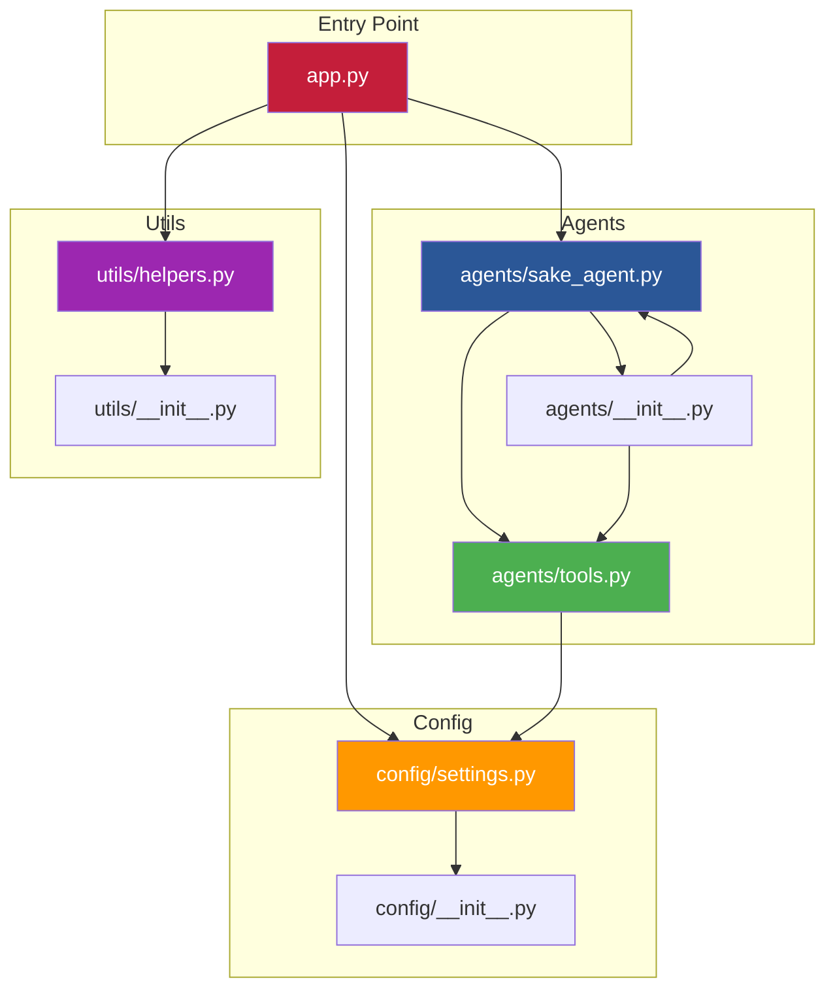

### Function Call Hierarchy

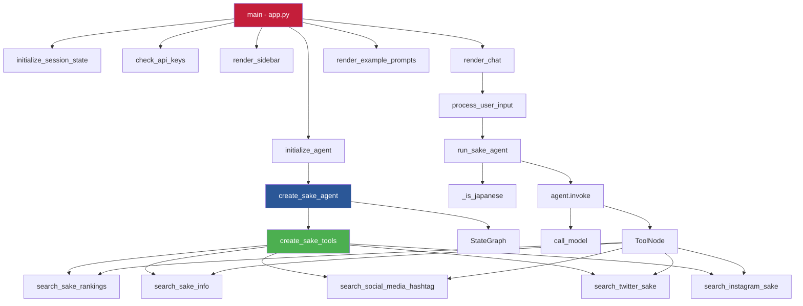

---

## Key Architectural Patterns

### 1. Closure-Based Configuration Pattern
Tools are created with API keys bound via closure to avoid passing secrets through arguments:

```python
def create_sake_tools(tavily_api_key: str):
    tavily_client = TavilyClient(api_key=tavily_api_key)

    @tool
    def search_sake_rankings(query: str):
        # tavily_client accessible via closure
        results = tavily_client.search(...)
        return results

    return [search_sake_rankings, ...]
```

### 2. LangGraph State Machine Pattern
Agent workflow uses reactive state transitions:

```
Entry → Agent Node → [Has tool_calls?] → Tools Node → Agent Node → ... → END
```

### 3. Bilingual Content Detection Pattern
Automatic language detection influences:
- Tool query enhancement
- Response language
- UI element selection

```python
def _is_japanese(text: str) -> bool:
    japanese_chars = re.findall(r'[\u3040-\u309F\u30A0-\u30FF\u4E00-\u9FFF]', text)
    return len(japanese_chars) > len(text) * 0.2
```

### 4. Error Resilience Pattern
All tools catch exceptions and return error strings:

```python
try:
    results = tavily_client.search(...)
    return format_results(results)
except Exception as e:
    return f"Error searching: {str(e)}"
```

### 5. Content Truncation Pattern
Search results are truncated to prevent token overflow:

```python
if len(content) > 500:
    content = content[:500] + "..."
```

---

## Performance Characteristics

### Agent Execution Metrics

| Metric | Value | Notes |
|--------|-------|-------|
| **Agent Initialization** | ~2-3s | One-time cost on first message |
| **Simple Query (No Tools)** | ~2-5s | LLM response only |
| **Tool-Using Query** | ~5-15s | Depends on tool count and Tavily latency |
| **Max Tool Iterations** | Unlimited | Controlled by LLM's decision-making |
| **Tavily Search Latency** | ~1-3s | Per search call |
| **OpenAI API Latency** | ~1-2s | Per LLM call |

### Scalability Considerations

- **Session State**: Per-user isolation via Streamlit sessions
- **Agent Instance**: One compiled agent per session (singleton)
- **Concurrent Users**: Limited by Streamlit Cloud free tier
- **Token Usage**: Controlled via content truncation

---

## Security Architecture

### Secrets Management

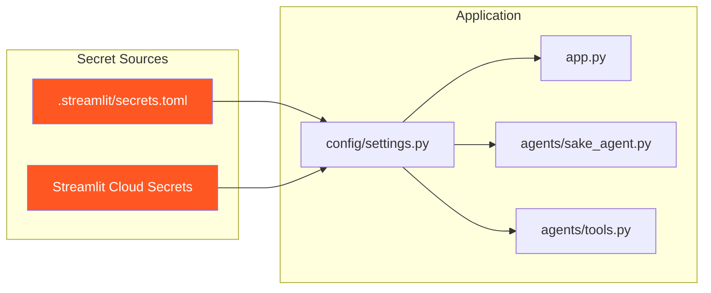

**Secret Storage:**
- Local: `.streamlit/secrets.toml` (gitignored)
- Production: Streamlit Cloud Secrets UI

**Secret Usage:**
- Never logged or displayed
- Passed via closure binding in tools
- Validated on application startup

### Data Privacy

- **User Messages**: Stored only in session state (not persisted)
- **Chat History**: Cleared on browser session end
- **External API Calls**: All searches logged by provider (Tavily, OpenAI)
- **No User Authentication**: No user data collected

---

## Future Enhancements

### Potential Architecture Extensions

1. **Caching Layer**
   - Redis for search result caching
   - Reduce Tavily API costs

2. **User Preferences**
   - Database for user profiles
   - Personalized recommendations

3. **Image Recognition**
   - Vision API integration
   - Sake label recognition

4. **Analytics Layer**
   - Query logging
   - Usage metrics
   - Popular sake tracking

5. **Multi-Agent System**
   - Specialized agents for different tasks
   - Ranking agent, pairing agent, etc.

---

## Conclusion

The Japanese Sake Guide App demonstrates a clean, modular architecture that separates concerns across presentation, agent orchestration, and tool execution layers. The LangGraph framework provides a flexible state machine for complex agent workflows, while Streamlit enables rapid UI development. The system is designed for extensibility, with clear patterns for adding new tools, data sources, and capabilities.

**Key Strengths:**
- Clear separation of concerns
- Language-agnostic design
- Extensible tool architecture
- Error-resilient execution
- Responsive user experience

**Architecture Principles:**
- Single Responsibility: Each module has a clear purpose
- Dependency Injection: API keys bound via closures
- State Isolation: Session state per user
- Fail-Safe: Graceful error handling throughout
