# System Architecture Diagram - Japanese Sake Guide App

## Table of Contents
1. [High-Level Architecture](#high-level-architecture)
2. [Component Architecture](#component-architecture)
3. [Data Flow Diagrams](#data-flow-diagrams)
4. [Technology Stack](#technology-stack)
5. [Module Relationships](#module-relationships)

---

## High-Level Architecture

The Japanese Sake Guide App is built on a three-tier architecture combining a Streamlit frontend, LangGraph agent middleware, and external API integrations.

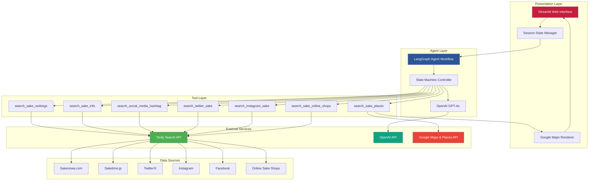

---

## Component Architecture

### 1. Application Entry Point (`app.py`)

**Responsibilities:**
- Page configuration and UI rendering
- API key validation
- Session state initialization and management
- Chat interface rendering
- User input processing
- Language preference management

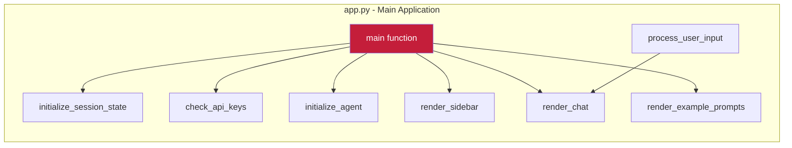

**Session State Variables:**
- `agent` - Compiled LangGraph StateGraph (singleton)
- `messages` - Display message history (list of dicts)
- `chat_history` - Agent message history (list of BaseMessage objects)
- `language` - Current UI language ("en" or "ja")

### 2. Agent Workflow (`agents/sake_agent.py`)

**Responsibilities:**
- LangGraph state machine orchestration
- Language detection from user input
- Agent execution and response extraction
- System prompt management

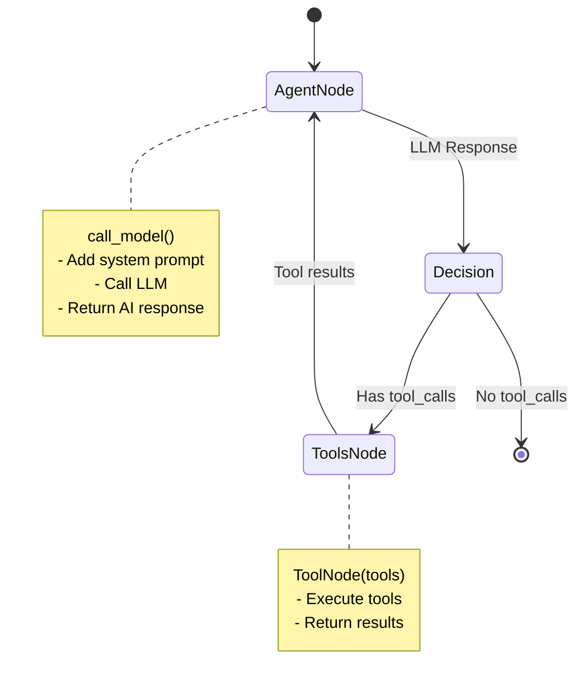

**Key Components:**
- `AgentState` - TypedDict with messages and language
- `SAKE_GUIDE_SYSTEM_PROMPT` - Expert sommelier system prompt
- `create_sake_agent()` - Builds and compiles StateGraph
- `run_sake_agent()` - Invokes agent and returns response

### 3. Agent Tools (`agents/tools.py`)

**Responsibilities:**
- Tavily API integration
- Search query enhancement
- Result formatting and truncation
- Language-aware query building

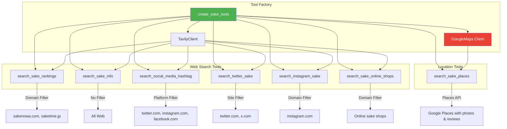

**Tool Specifications:**

| Tool | API | Max Results | Search Depth | Content Limit | Domain Filter |
|------|-----|-------------|--------------|---------------|---------------|
| search_sake_rankings | Tavily | 8 | advanced | 500 chars | sakenowa.com, saketime.jp |
| search_sake_info | Tavily | 6 | advanced | 600 chars | None |
| search_social_media_hashtag | Tavily | 10 | advanced | 300 chars | Platform-based |
| search_twitter_sake | Tavily | 10 | advanced | 300 chars | twitter.com, x.com |
| search_instagram_sake | Tavily | 10 | advanced | 300 chars | instagram.com |
| search_sake_places | Google Maps | 10 | N/A | N/A | Google Places API |
| search_sake_online_shops | Tavily | 10 | advanced | 500 chars | jizake.com, matsuzaki-shop.jp, etc. |

**search_sake_places Tool - Dual Mode Operation:**

The `search_sake_places` tool is a unified location search tool that operates in two distinct modes:

1. **Specific Sake Brand Mode** (when `sake_name` parameter is provided):
   - Finds restaurants/bars/izakayas serving a specific sake brand
   - Uses Google Places Text Search for better accuracy
   - Examples: "Find places serving Dassai in Tokyo", "写楽が飲める店は？"
   - Returns locations with sake brand badge in map markers

2. **General Location Mode** (when `sake_name` parameter is None):
   - Finds general sake shops, restaurants, or bars in a location
   - Uses Google Places Nearby Search
   - Supports `search_type` parameter: "shop", "restaurant", or "both"
   - Examples: "Find sake shops in Kyoto", "東京の日本酒バーを教えて"

Both modes return:
- Up to 10 locations with coordinates for map display
- Photos (up to 3 per location)
- Reviews (up to 3 per location)
- Ratings, addresses, phone numbers, websites
- Google Maps URLs for each location
- Structured JSON data embedded in response with `MAP_DATA_START/END` markers

### 4. Configuration (`config/settings.py`)

**Responsibilities:**
- Centralized settings management
- API key loading from Streamlit secrets
- Default configuration values

```python
@dataclass
class Settings:
    openai_api_key: str
    tavily_api_key: str
    instagram_access_token: Optional[str] = None
    sake_ranking_urls: tuple = (...)
    openai_model: str = "gpt-4o"
    temperature: float = 0.7
    max_search_results: int = 5
```

### 5. Utilities (`utils/helpers.py`)

**Responsibilities:**
- Language detection utilities
- Response formatting
- Example prompt constants

**Key Functions:**
- `detect_language(text)` - Analyzes text for Japanese characters
- `format_sake_response(response, language)` - Post-processes agent output

**Constants:**
- `EXAMPLE_PROMPTS` - 4 example prompts per language
- `SIDEBAR_EXAMPLE_PROMPTS` - Tool-categorized examples for sidebar

---

## Data Flow Diagrams

### 1. Application Startup Flow

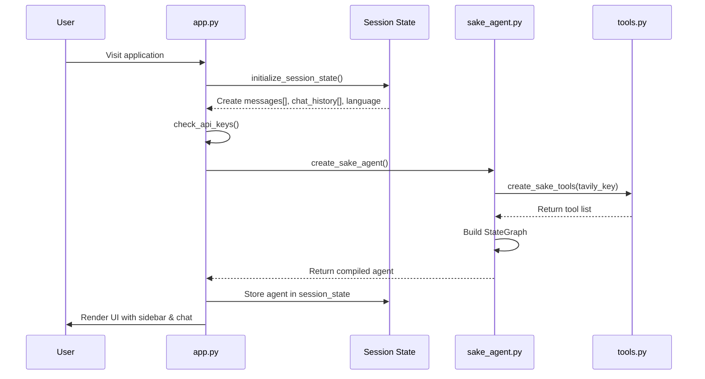

### 2. User Message Processing Flow

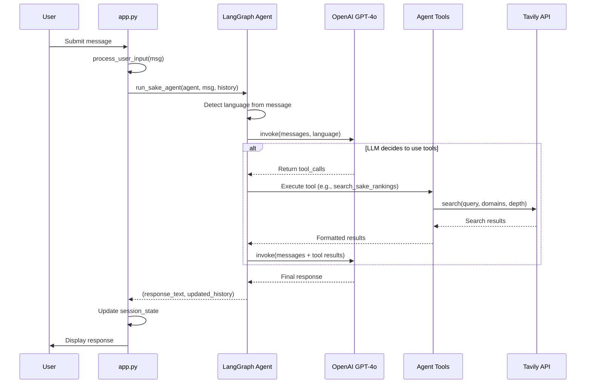

### 3. Map Data Flow (Location Search)

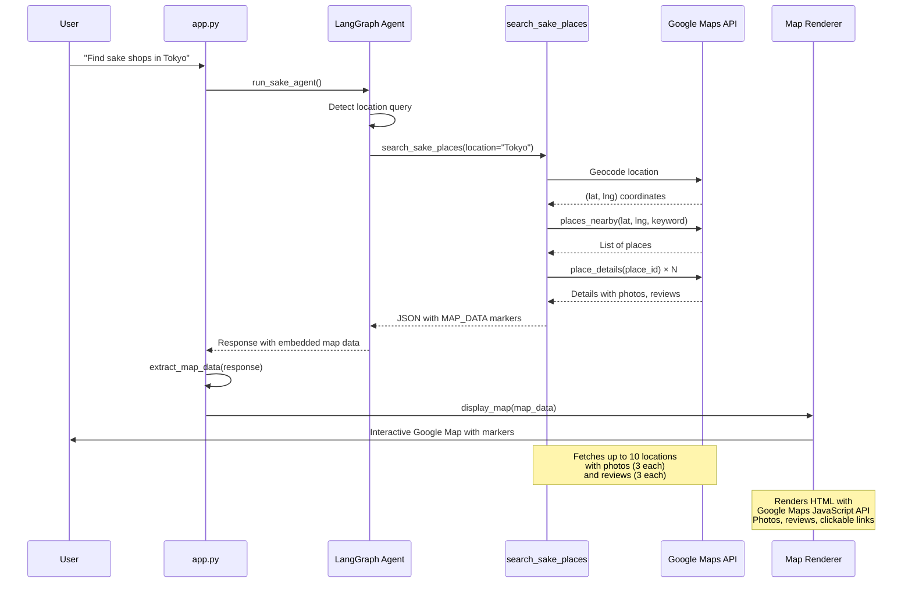

### 4. Tool Execution Flow (Detailed)

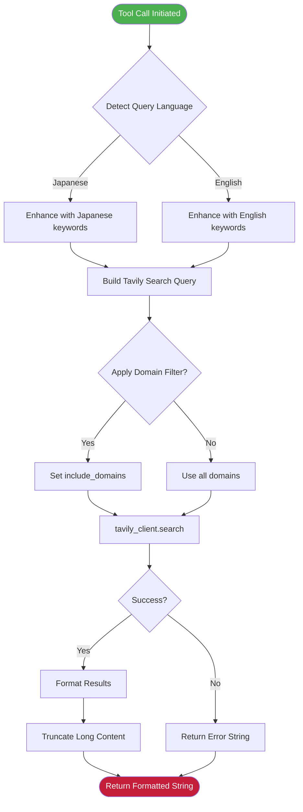

### 4. Session State Management Flow

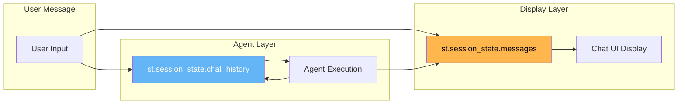

**Message Object Types:**
- **Display Messages** (`st.session_state.messages`): Dicts with `{role, content}` for UI rendering
- **Agent Messages** (`st.session_state.chat_history`): LangChain message objects (HumanMessage, AIMessage, ToolMessage)

---

## Technology Stack

### Core Dependencies

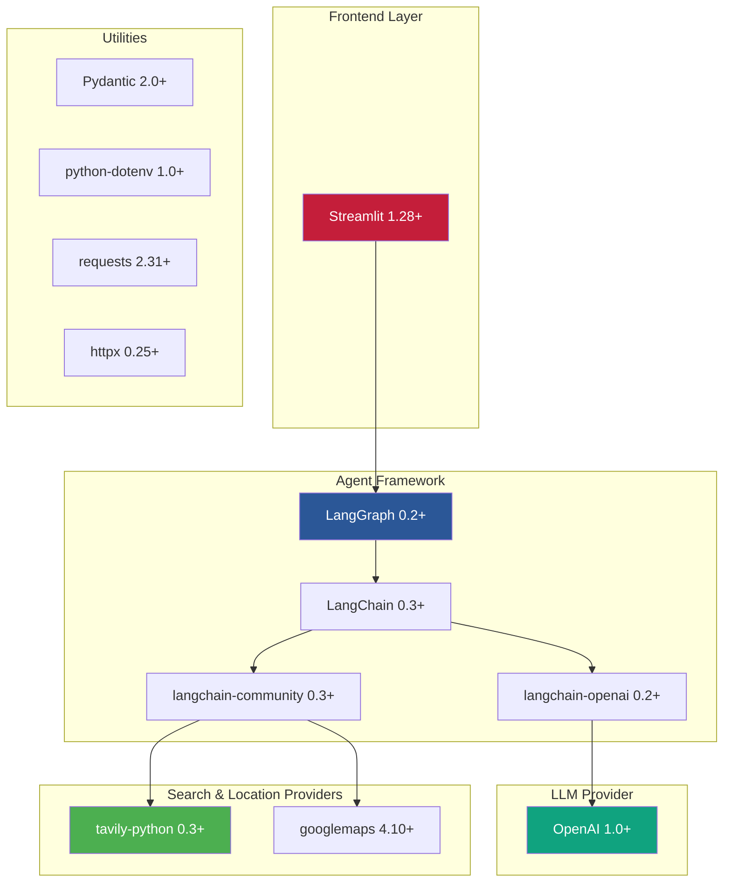

### External Services

| Service | Purpose | Authentication | Configuration |
|---------|---------|----------------|---------------|
| **OpenAI API** | LLM for agent reasoning | API Key | `OPENAI_API_KEY` in secrets |
| **Tavily API** | Web and social media search | API Key | `TAVILY_API_KEY` in secrets |
| **Google Maps & Places API** | Location search with photos, reviews, maps | API Key | `GOOGLE_MAPS_API_KEY` in secrets (optional) |
| **Streamlit Cloud** | Application hosting | OAuth | Automatic deployment |

---

## Module Relationships

### Dependency Graph

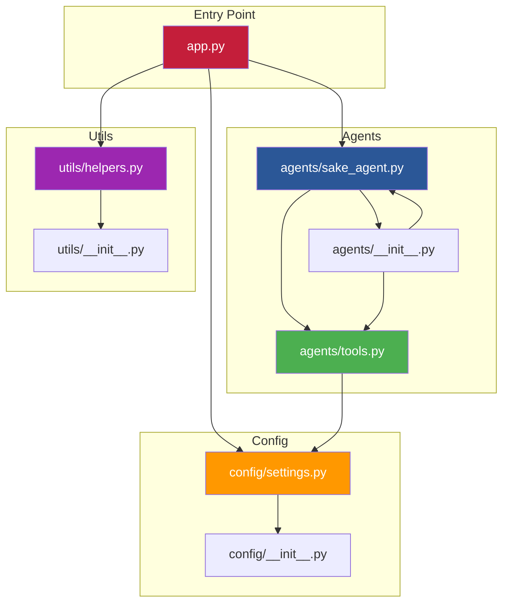

### Function Call Hierarchy

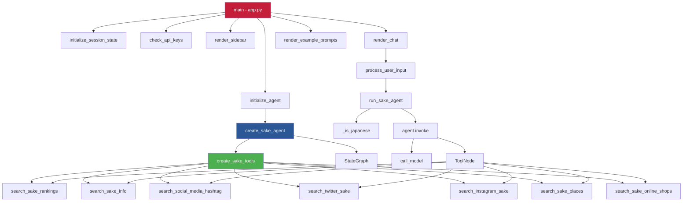

---

## Key Architectural Patterns

### 1. Closure-Based Configuration Pattern
Tools are created with API keys bound via closure to avoid passing secrets through arguments:

```python
def create_sake_tools(tavily_api_key: str):
    tavily_client = TavilyClient(api_key=tavily_api_key)

    @tool
    def search_sake_rankings(query: str):
        # tavily_client accessible via closure
        results = tavily_client.search(...)
        return results

    return [search_sake_rankings, ...]
```

### 2. LangGraph State Machine Pattern
Agent workflow uses reactive state transitions:

```
Entry → Agent Node → [Has tool_calls?] → Tools Node → Agent Node → ... → END
```

### 3. Bilingual Content Detection Pattern
Automatic language detection influences:
- Tool query enhancement
- Response language
- UI element selection

```python
def _is_japanese(text: str) -> bool:
    japanese_chars = re.findall(r'[\u3040-\u309F\u30A0-\u30FF\u4E00-\u9FFF]', text)
    return len(japanese_chars) > len(text) * 0.2
```

### 4. Error Resilience Pattern
All tools catch exceptions and return error strings:

```python
try:
    results = tavily_client.search(...)
    return format_results(results)
except Exception as e:
    return f"Error searching: {str(e)}"
```

### 5. Content Truncation Pattern
Search results are truncated to prevent token overflow:

```python
if len(content) > 500:
    content = content[:500] + "..."
```

### 6. Structured Data Embedding Pattern
Map data is embedded in agent responses using special markers:

```python
# In search_sake_places tool:
output.append("MAP_DATA_START")
map_data = {
    "center_lat": lat,
    "center_lng": lng,
    "locations": [...]
}
output.append(json.dumps(map_data))
output.append("MAP_DATA_END")

# In app.py:
map_data = extract_map_data(response_text)
if map_data:
    display_map(map_data)
```

This pattern allows the agent to return both human-readable text and structured data for interactive components in a single response.

### 7. Map Rendering with Google Maps JavaScript API
Interactive maps are rendered using Streamlit's `components.html()`:

```python
# Generate HTML with Google Maps JavaScript API
map_html = f"""
<script src="https://maps.googleapis.com/maps/api/js?key={api_key}&callback=initMap"></script>
<script>
    function initMap() {{
        // Create map, markers, info windows with photos and reviews
    }}
</script>
"""

# Render in Streamlit
components.html(map_html, height=650)
```

Each marker displays:
- Location name and address
- Rating with star visualization
- Up to 3 photos (fetched via Google Photos API)
- Up to 3 reviews with author and timestamp
- Clickable Google Maps and website links

---

## Performance Characteristics

### Agent Execution Metrics

| Metric | Value | Notes |
|--------|-------|-------|
| **Agent Initialization** | ~2-3s | One-time cost on first message |
| **Simple Query (No Tools)** | ~2-5s | LLM response only |
| **Tool-Using Query** | ~5-15s | Depends on tool count and Tavily latency |
| **Max Tool Iterations** | Unlimited | Controlled by LLM's decision-making |
| **Tavily Search Latency** | ~1-3s | Per search call |
| **OpenAI API Latency** | ~1-2s | Per LLM call |

### Scalability Considerations

- **Session State**: Per-user isolation via Streamlit sessions
- **Agent Instance**: One compiled agent per session (singleton)
- **Concurrent Users**: Limited by Streamlit Cloud free tier
- **Token Usage**: Controlled via content truncation

---

## Security Architecture

### Secrets Management

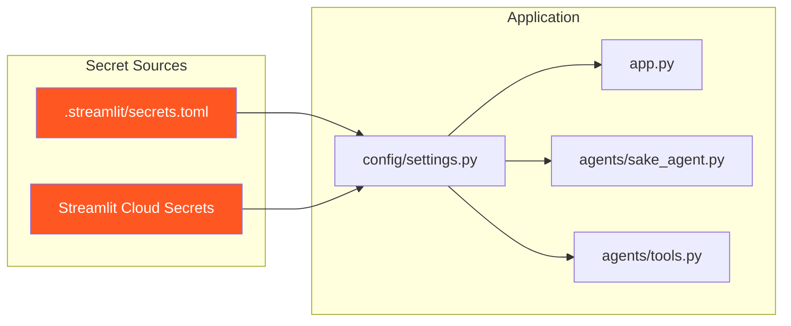

**Secret Storage:**
- Local: `.streamlit/secrets.toml` (gitignored)
- Production: Streamlit Cloud Secrets UI

**Secret Usage:**
- Never logged or displayed
- Passed via closure binding in tools
- Validated on application startup

### Data Privacy

- **User Messages**: Stored only in session state (not persisted)
- **Chat History**: Cleared on browser session end
- **External API Calls**: All searches logged by provider (Tavily, OpenAI)
- **No User Authentication**: No user data collected

---

## Recently Implemented Features

The following features have been successfully implemented in the current version:

1. **✅ Google Maps Integration**
   - Interactive maps with photos and reviews
   - Dual-mode location search (specific sake brands vs. general locations)
   - Real-time place details with ratings and contact information

2. **✅ Online Shop Search**
   - Search across 7+ specialized Japanese sake online shops
   - Direct purchase links to sake products
   - Integration with jizake.com, matsuzaki-shop.jp, sakenomy.jp, and more

3. **✅ Multi-Platform Social Media Search**
   - Cross-platform hashtag search (Twitter/X, Instagram, Facebook)
   - Platform-specific search tools for targeted discovery
   - Real-time social media content aggregation

## Future Enhancements

### Potential Architecture Extensions

1. **Caching Layer**
   - Redis for search result caching
   - Reduce API costs and improve response times
   - Cache Google Places results for frequently searched locations

2. **User Preferences**
   - Database for user profiles
   - Personalized recommendations based on taste history
   - Saved favorite sake and locations

3. **Image Recognition**
   - Vision API integration
   - Sake label recognition and identification
   - Food pairing suggestions from uploaded photos

4. **Analytics Layer**
   - Query logging and usage metrics
   - Popular sake tracking and trend analysis
   - Regional search pattern analysis

5. **Multi-Agent System**
   - Specialized agents for different tasks
   - Ranking agent, pairing agent, location agent, etc.
   - Parallel agent execution for complex queries

---

## Conclusion

The Japanese Sake Guide App demonstrates a clean, modular architecture that separates concerns across presentation, agent orchestration, and tool execution layers. The LangGraph framework provides a flexible state machine for complex agent workflows, while Streamlit enables rapid UI development with rich interactive components like Google Maps. The system is designed for extensibility, with clear patterns for adding new tools, data sources, and capabilities.

**Current Capabilities:**
- 7 specialized tools covering rankings, detailed info, social media, and location search
- Multi-platform social media search (Twitter/X, Instagram, Facebook)
- Interactive Google Maps with photos, reviews, and ratings
- Dual-mode location search (specific sake brands vs. general sake locations)
- Online sake shop integration for purchasing
- Full bilingual support (English and Japanese)
- Real-time web search and location data

**Key Strengths:**
- Clear separation of concerns across layers
- Language-agnostic design with automatic detection
- Extensible tool architecture via closure-based factory pattern
- Error-resilient execution with graceful fallbacks
- Responsive user experience with interactive maps
- Structured data embedding for rich UI components

**Architecture Principles:**
- **Single Responsibility**: Each module has a clear purpose
- **Dependency Injection**: API keys bound via closures
- **State Isolation**: Session state per user
- **Fail-Safe**: Graceful error handling throughout
- **Data Embedding**: Structured data in text responses for interactive components
- **Progressive Enhancement**: Core features work without optional APIs (e.g., Google Maps)
